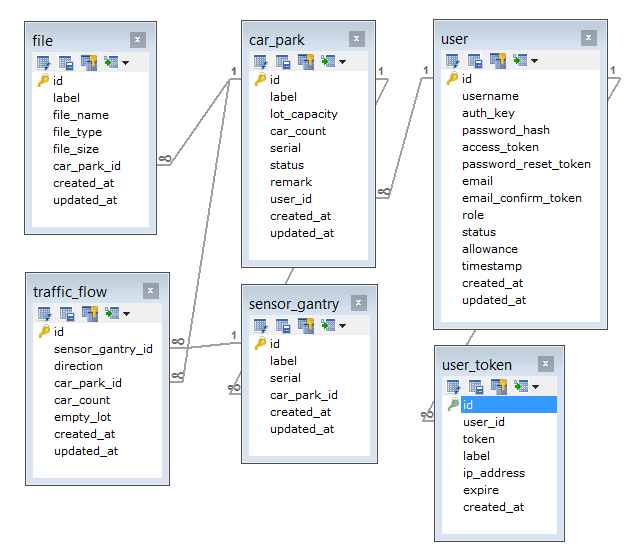

# Parking Lots #

* Server: http://eceiot.np.edu.sg/parking-lots/api/web/index.php/v1
* IP Address: 128.199.77.122

## Database ##

__List of Key Database Tables__

Table   | Remark
---     | ---
car_park | A parking area with one or more sensor gantries.
sensor_gantry | A sensor on the road side which can detect entry and/or exit of cars of a car_park
traffic_flow | A event of car entry or exit
user | list of users

---

## Available Web Service ##

__Common Web Service Operations__
Web services are operations for database tables. Basic operations are closely related to database operations. 

Operation   | Remark
---     | ---
List    | List all objects in the table
View    | View an object with its ID
Search  | Search for objects with some conditions
Create  | Create an new object in database
Update  | Update an object identified by ID
Delete  | Delete an object from table
Other Custom Functions  | Customized web service function

## Car Park ##
> A parking area with one or more sensor gantries.

#### list ####
> List all car parks. Optional to get related gantries and owner (creator) of each car park.

* URL: /car-park?expand=gantries
* Method: GET
* Access: Anonymous

Example

* http://eceiot.np.edu.sg/parking-lots/api/web/index.php/v1/car-park
* http://eceiot.np.edu.sg/parking-lots/api/web/index.php/v1/car-park?expand=gantries

## Traffic Flow ##
> Each car-entry or car-exit event is recorded as a traffic-flow.

#### Car Entry ####
> create a traffic flow for car-entry event. It will also update the car-count column in car-park table, and entry-count column in sensor-gantry table.

* URL: /traffic-flow/car-entry/<gantry_serial\>
* Method: POST
* Access: Anonymous (Authentication is not required at the moment) 

Example

* http://eceiot.np.edu.sg/parking-lots/api/web/index.php/v1/traffic-flow/car-entry/6792b9e854279c65e722

#### Car Exit ####
> create a traffic flow for car-entry event. It will also update the car-count column in car-park table, and exit-count column in sensor-gantry table. gantry_serial is a unique ID of a gantry

* URL: /traffic-flow/car-exit/<gantry_serial\>
* Method: POST
* Access: Anonymous (Authentication is not required at the moment) 

Example

* http://eceiot.np.edu.sg/parking-lots/api/web/index.php/v1/traffic-flow/car-exit/6792b9e854279c65e722

